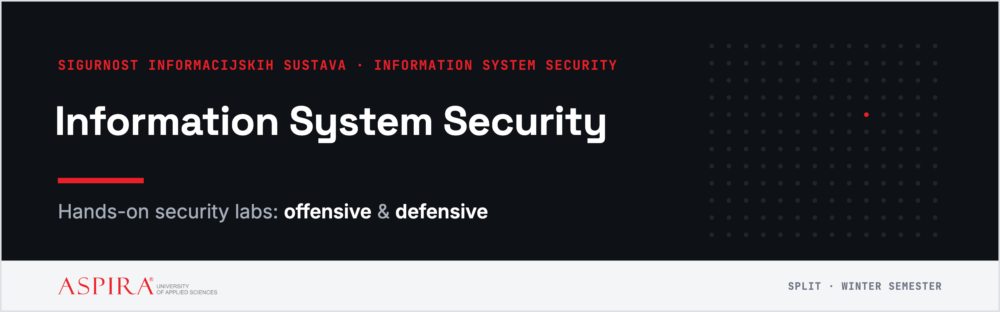

  

  
  
  
  
  

Hands-on labs for **Sigurnost informacijskih sustava / Information System Security** at Aspira University of Applied Sciences, Split. Every lab pairs an **offensive** half (perform the attack) with a **defensive** half (detect it or fix it). Each lab's instructions live here; the same text is on **Merlin** as a PDF, and you **submit on Merlin**.

> [!WARNING]
> These labs contain **intentionally vulnerable** software and offensive tools. Use them **only inside your own lab environment**, never against real systems or other people's accounts — that is a criminal offence in Croatia and the EU.

## 🧰 Environment

You run everything from a **Kali Linux** machine with Docker — set it up once in **[Lab 00](lab-00-okruzenje/README.md)**. This is *not* a GitHub Codespaces repo: the labs use GUI and offensive tools (Wireshark, Burp, hashcat, nmap, Metasploit) that belong on Kali, and Docker runs the vulnerable targets inside it.

## 🧪 Labs

| # | Lab | Attack → Defend | Target |
|:-:|---|---|---|
| 00 | [Set up your lab](lab-00-okruzenje/README.md) | — | Kali + Docker |
| 01 | [Password hashing & cracking](lab-01-hashiranje/README.md) | crack weak hashes → salt + slow KDF | hashcat |
| 02 | [Cryptography: breaking weak crypto](lab-02-kriptografija/README.md) | recover a flag from bad "encryption" → AES-GCM | openssl + Python |
| 03 | [Network traffic: interception & detection](lab-03-promet/README.md) | sniff a login → spot the scan | DVWA |
| 04 | [Web attacks I: injection & XSS](lab-04-web-injection/README.md) | SQLi + XSS → parameterize + encode | DVWA |
| 05 | [Web attacks II: authentication & access](lab-05-web-auth/README.md) | IDOR + JWT → server-side authz | OWASP Juice Shop |
| 06 | [Exploitation & privilege escalation](lab-06-eksploatacija/README.md) | crack + privesc → close the chain | vulnerable SSH container |
| 07 | [Capstone: attack & investigate](lab-07-ctf/README.md) | CTF → incident analysis | Juice Shop + logs |
| 08 | [AI security: prompt injection](lab-08-ai-security/README.md) | extract a secret → guardrails | local LLM (Ollama) |

## 🚩 How the labs work

The material is the same for everyone. The personal part is **your student ID (matični broj)**, which you enter while working — the target then computes **your** unique flag from it.

1. Start the target as the lab says, and **enter your student ID**.
2. Do the lab and **extract your flag**.
3. Submit a **PDF report** with the flag and an **[asciinema](https://asciinema.org/) recording** on Merlin.

A copied flag won't match your student ID, so it won't count. Full student guide: see the course page on Merlin.

## 📁 What's inside

- `lab-NN-*/` — each lab: `README.md` (English) and `README.hr.md` (Croatian) instructions + its `compose.yml` / target files. The README is the single source: GitHub renders it, and `tools/build-pdf.sh lab-NN/README.md` produces the styled Merlin PDF from the same file.
- `_lab-env/` — the shared flag tooling: `flaglib.py` (flag formula), `flaggen/checker.py` (instructor answer key over the class roster), `flaggen/gen.py` (Lab 01 hash files). See [`_lab-env/README.md`](_lab-env/README.md).
- `tools/` — `build-pdf.sh` + `ghmd2styled.py` + `handout.css` turn a lab README into the Merlin PDF (needs `apex`, Chrome, `python3`).
- `*/.env.example` — copy to `.env` and fill in; the real `.env`, PDFs and answer keys are **git-ignored** and never published.

## 📜 License

Lab text and instructions: **[CC BY 4.0](LICENSE)**. Code, scripts and configs: **[MIT](LICENSE-CODE)**. © 2026 Ante Projić.
